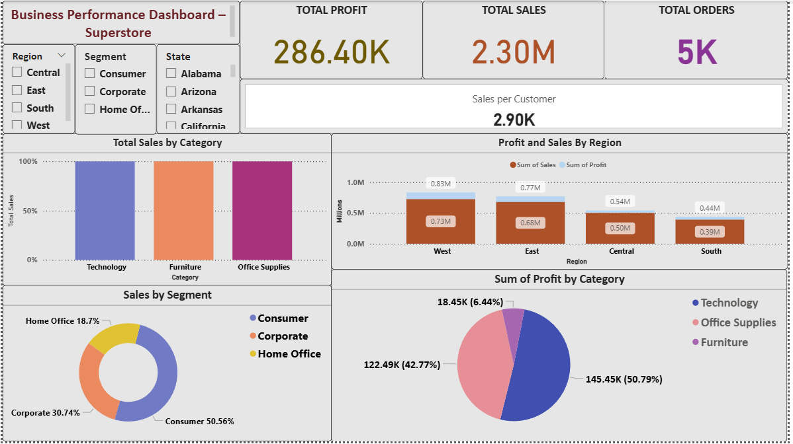

# Power BI Sales Dashboard - Superstore Dataset 📊

This Power BI report provides business insights into sales and profits using the Sample Superstore dataset. The dashboard includes KPIs, category-wise analysis, segment performance, and interactive filters to allow dynamic exploration of data.

---

## 🔍 Key Insights

- 💰 **Total Profit**: ₹286.40K  
- 🛒 **Total Sales**: ₹2.30M  
- 📦 **Total Orders**: 5K  
- 👤 **Sales per Customer**: ₹2.90K  

These KPIs are shown at the top of the dashboard to give a quick overview of overall performance.

---

## 📌 Features

- 🎯 **KPI Cards**: High-level metrics like Total Sales, Profit, Orders, and Avg. Sales per Customer
- 📊 **Category & Region Analysis**: Visualizations showing sales and profit by product category and region
- 🧩 **Segment-wise Performance**: Pie and bar charts for analyzing profits by customer segments
- 🎛️ **Interactive Filters (Slicers)**:
  - **Region**: Select from Central, East, South, and West to view region-specific data  
  - **Segment**: Filter insights by Consumer, Corporate, or Home Office customer segments  
  - **State**: Drill down further by selecting one or more states to analyze local performance  
  - **Category** *(optional)*: Narrow down visuals to focus on Furniture, Office Supplies, or Technology

These filters dynamically change the visuals across the dashboard, enabling tailored insights.

---

## 📷 Screenshots

### 🖥️ Full Dashboard  

> A complete view of the interactive dashboard including KPIs, charts, and slicers.

### 📌 KPI Cards  

> Showcasing Total Sales, Profit, Orders, and per-customer metrics for a quick snapshot.

### 🎛️ Filters Used  

> Filters (slicers) applied on the right panel to let users segment data by Region, Segment, and State for deeper analysis.

---

## 📁 Files Included

- `Sales_Dashboard.pbix` – Power BI dashboard file  
- `Sales_Dashboard.pdf` – Exported report in PDF format  
- Screenshot images for presentation and documentation  
- `README.md` – This documentation file

---

## 📄 Notes

- You can open `.pbix` files using [Microsoft Power BI Desktop](https://powerbi.microsoft.com/desktop).

---

